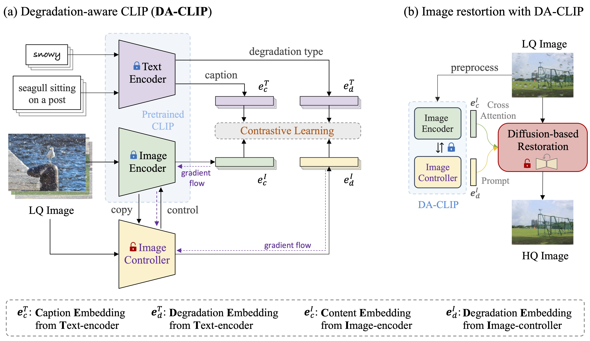
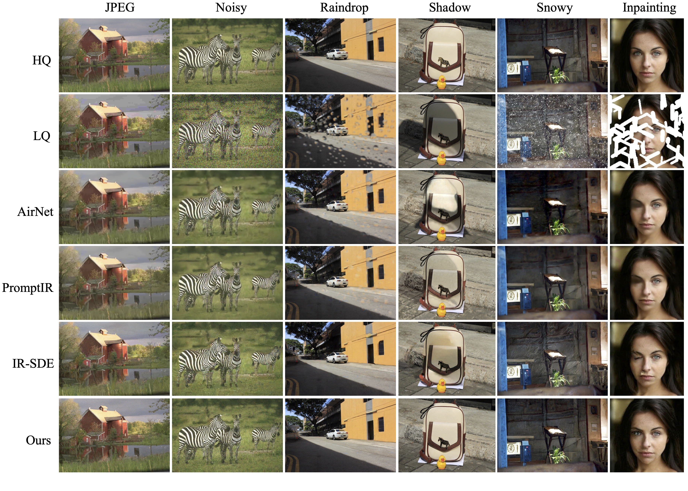

## Controlling Vision-Language Models for Universal Image Restoration <br><sub>Official PyTorch Implementation of DA-CLIP. </sub>

[Project Page](https://algolzw.github.io/daclip-uir) | [Paper](https://arxiv.org/abs/2310.01018)


### Overview framework:



## How to Run the Code?

### Install

We advise you first create a virtual environment with:

```bash
python3 -m venv .env
source .env/bin/activate
pip install -U pip
pip install -r requirements.txt

```

### DA-CLIP Usage

Get into the `universal-image-restoration` directory and run:

```python
import torch
from PIL import Image
import open_clip

checkpoint = 'pretrained/daclip_ViT-B-32.pt'
model, preprocess = open_clip.create_model_from_pretrained('daclip_ViT-B-32', pretrained=checkpoint)
tokenizer = open_clip.get_tokenizer('ViT-B-32')

image = preprocess(Image.open("haze_01.png")).unsqueeze(0)
degradations = ['motion-blurry','hazy','jpeg-compressed','low-light','noisy','raindrop','rainy','shadowed','snowy','uncompleted']
text = tokenizer(degradations)

with torch.no_grad(), torch.cuda.amp.autocast():
    text_features = model.encode_text(text)
    image_features, degra_features = model.encode_image(image, control=True)
    degra_features /= degra_features(dim=-1, keepdim=True)
    text_features /= text_features.norm(dim=-1, keepdim=True)

    text_probs = (100.0 * degra_features @ text_features.T).softmax(dim=-1)
    index = torch.argmax(text_probs[0])

print(f"Task: {task_name}: {degradations[index]} - {text_probs[0][index]}")
```

### Dataset Preparation

Preparing the train and test datasets following our paper Dataset Construction section as:

```bash
#### for training dataset ####
#### (uncompleted means inpainting) ####
datasets/universal/train
|--motion-blurry
|  |--LQ/*.png
|  |--GT/*.png
|--hazy
|--jpeg-compressed
|--low-light
|--noisy
|--raindrop
|--rainy
|--shadowed
|--snowy
|--uncompleted

#### for testing dataset ####
#### (the same structure as train) ####
datasets/universal/val
...

#### for clean captions ####
datasets/universal/daclip_train.csv
datasets/universal/daclip_val.csv
```

Then get into the `universal-image-restoration/config/daclip-sde` directory and modify the dataset paths in option files in `options/train.yml` and `options/tes.yml`. 

You can add more tasks or datasets to both `train` and `val` directories and add the degradation word to `distortion`.


### Training

#### DA-CLIP 
(Coming soon...)

#### Universal Image Restoration
The main code for training is in `universal-image-restoration/config/daclip-sde` and the core network for DA-CLIP is in `universal-image-restoration/open_clip/daclip_model.py`.

* Put the pretrained [**DA-CLIP weights**](https://drive.google.com/file/d/1A6u4CaVrcpcZckGUNzEXqMF8x_JXsZdX/view?usp=sharing) to `pretrained` directory and check the `daclip` path.

* You can then train the model following below bash scripts:

```bash
cd universal-image-restoration/config/daclip-sde

# For single GPU:
python3 train.py -opt=options/train.yml

# For distributed training, need to change the gpu_ids in option file
python3 -m torch.distributed.launch --nproc_per_node=2 --master_poer=4321 train.py -opt=options/train.yml --launcher pytorch
```

The models and training logs will save in `log/universal-ir`. 
You can print your log at time by running `tail -f log/universal-ir/train_universal-ir_***.log -n 100`.

### Evaluation
To evalute our method on image restoration, please modify the benchmark path and model path and run

```bash
cd universal-image-restoration/config/universal-ir
python test.py -opt=options/test.yml
```

### Results


<details>
<summary><strong>Unified Image Restoration</strong> (click to expand) </summary>



</details>

<details>
<summary><strong>Degradation-Specific Restoration</strong> (click to expand) </summary>


</details>


---

**Acknowledgment:** Our DA-CLIP is based on [IR-SDE](https://github.com/Algolzw/image-restoration-sde) and [open_clip](https://github.com/mlfoundations/open_clip). Thanks for their code!

#### Contact
If you have any question, please contact: ziwei.luo@it.uu.se


#### --- Thanks for your interest! --- ####

<details>
<summary>statistics</summary>


</details>

